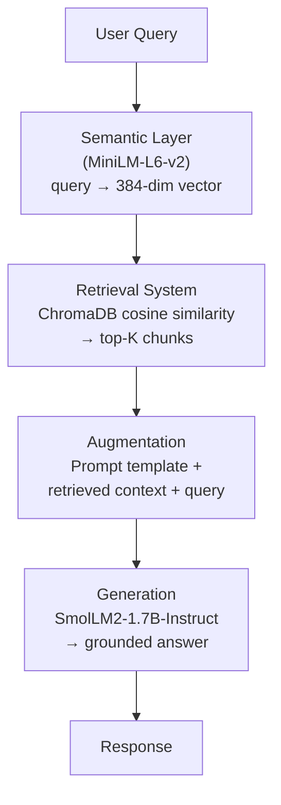
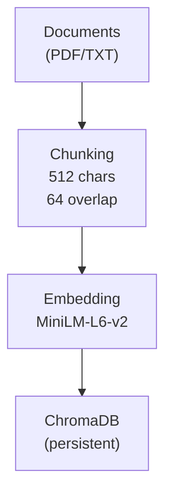

# Architecture & Design Rationale

## High-Level Architecture

### Offline Indexing Pipeline (runs once)

## Component Details

### 1. Knowledge Base — ChromaDB

**What:** An embedded vector database that stores document chunks
alongside their semantic embeddings and metadata.

**Why ChromaDB:**
- Runs in-process — no separate server, no Docker, no config files
- Persistent mode survives kernel restarts (PersistentClient)
- Native Python, installs via pip
- Cosine similarity search built-in
- Stores documents, embeddings, and metadata together

**Trade-off considered:** FAISS is faster for large-scale search but
requires manual metadata management. For a demo with hundreds of chunks,
ChromaDB's simplicity wins.

### 2. Semantic Layer — all-MiniLM-L6-v2

**What:** A sentence-transformers model that converts text (both documents
and queries) into 384-dimensional dense vectors. These vectors capture
semantic meaning, so "automobile" and "car" end up close together in
vector space.

**Why this model:**
- 80 MB download — trivial to install
- Produces embeddings in ~16ms per chunk on CPU
- Well-benchmarked for semantic similarity and retrieval tasks
- Default embedding model in many RAG tutorials and production systems
- 384 dimensions is compact enough for fast search, expressive enough
  for good retrieval quality

**Trade-off considered:** BGE-small-en-v1.5 scores slightly higher on
retrieval benchmarks but is larger and slower. For this demo, MiniLM's
speed and proven track record make it the right pick.

### 3. Retrieval System — Cosine Similarity Top-K

**What:** At query time, we embed the user's question with the same
MiniLM model, then ask ChromaDB to return the K most similar chunks
by cosine distance.

**Why cosine similarity:**
- Standard metric for comparing normalized embeddings
- Directly supported by ChromaDB (no custom code)
- Interpretable: distance of 0 = identical, 2 = opposite

**Why K=5:**
- Balances recall (finding relevant info) against noise (including
  irrelevant chunks that confuse the LLM)
- With 512-char chunks, 5 results ≈ 2,500 chars of context — well
  within the model's context window

### 4. Augmentation — Prompt Engineering

**What:** We combine the retrieved chunks with the user query into a
structured prompt that instructs the LLM to answer using only the
provided context and cite its sources.

**Key design choices:**
- Explicit instruction: "Answer using ONLY the context below"
  (reduces hallucination)
- Source labels: Each chunk is tagged [Source 1], [Source 2], etc.
  (enables citation in the response)
- Fallback instruction: "If the context doesn't contain enough
  information, say so" (honest uncertainty rather than fabrication)

### 5. Generation — SmolLM2-1.7B-Instruct

**What:** A 1.7B parameter instruction-tuned language model from
Hugging Face that runs on CPU via the standard transformers library.

**Why SmolLM2-1.7B-Instruct:**
- 1.7B parameters — fits in ~4 GB RAM, runs on any modern laptop
- Apache 2.0 license — no restrictions
- Strong instruction following (IFEval: 56.7%, best in class for
  models under 2B params)
- Trained by Hugging Face — excellent transformers integration,
  no special dependencies
- Outperforms TinyLlama-1.1B and Llama-1B-Instruct on nearly every
  benchmark

**Trade-offs considered:**
- TinyLlama-1.1B: Smaller but significantly weaker at instruction
  following — produces more off-topic or incoherent answers
- Qwen2.5-0.5B-Instruct: Tiny (0.5B) but too weak for grounded QA —
  frequently ignores context and hallucates
- Phi-3-mini (3.8B): Better quality but needs ~8GB RAM just for
  the model — risky if the reviewer has only 8GB total
- SmolLM2-1.7B hits the sweet spot: good enough quality, small
  enough to run anywhere

## Chunking Strategy

**Method:** RecursiveCharacterTextSplitter (LangChain)
**Chunk size:** 512 characters
**Overlap:** 64 characters

**Why these numbers:**
- 512 chars ≈ 100-130 tokens — specific enough for precise retrieval,
  long enough to contain a coherent idea
- 64 chars overlap (12.5%) — prevents information loss at chunk
  boundaries where a key sentence straddles two chunks
- Recursive splitting respects paragraph > sentence > word boundaries,
  keeping chunks semantically coherent

## What I Would Add for Production

1. **Hybrid retrieval** (vector + BM25 keyword search) — catches
   exact-match terms that embeddings might miss
2. **Reranking** with a cross-encoder — re-scores the top-K results
   for higher precision
3. **Hierarchical chunking** — small chunks for retrieval, parent
   chunks for context
4. **Evaluation framework** — automated retrieval quality metrics
   (MRR, recall@K) on a labeled test set
5. **Guardrails** — input/output filtering to prevent misuse
6. **Streaming generation** — for better UX in a real application
